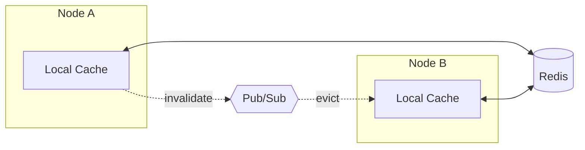

# Session

**Type-safe, production-ready session management for Crystal.**

[](https://github.com/azutoolkit/session/actions)
[](https://app.codacy.com/gh/azutoolkit/session)
[](https://opensource.org/licenses/MIT)

---

## Why Session?

| | |
|---|---|
| **Type-Safe** | Define sessions as Crystal structs with compile-time guarantees |
| **Multiple Backends** | Cookie, Memory, Redis, or Clustered Redis—pick what fits |
| **Battle-Tested Security** | AES-256 encryption, HMAC-SHA256, PBKDF2, client binding |
| **Production Resilience** | Circuit breakers, retry logic, graceful degradation |
| **329+ Tests** | Comprehensive coverage you can rely on |

---

## Quick Start

**Install** (add to `shard.yml`):

```yaml
dependencies:
  session:
    github: azutoolkit/session
```

**Use** (< 30 seconds to your first session):

```crystal
require "session"

# Define your session data
struct UserSession
  include Session::SessionData
  property user_id : Int64?
  property username : String?
end

# Configure once
Session.configure do |config|
  config.secret = ENV["SESSION_SECRET"]
  config.provider = Session::MemoryStore(UserSession).provider
end

# Create and use sessions
session = Session.provider.create
session.data.user_id = 42
session.data.username = "alice"
```

That's it. You're ready to build.

---

## Key Features

### Storage Backends

| Backend | Best For | Persistence | Multi-Node |
|---------|----------|-------------|------------|
| **CookieStore** | Stateless apps, serverless | Client-side | Yes |
| **MemoryStore** | Development, single-server | None | No |
| **RedisStore** | Production deployments | Redis | Yes |
| **ClusteredRedisStore** | High-scale, multi-node | Redis + local cache | Yes |

```crystal
# Cookie (stateless, client-side)
config.provider = Session::CookieStore(UserSession).provider

# Memory (development)
config.provider = Session::MemoryStore(UserSession).provider

# Redis (production)
config.provider = Session::RedisStore(UserSession).provider(client: Redis.new)

# Clustered Redis (high-scale production)
config.cluster.enabled = true
config.provider = Session::ClusteredRedisStore(UserSession).new(client: Redis.new)
```

### Security

- **Encryption** — AES-256-CBC with random IV per operation
- **Signing** — HMAC-SHA256 to detect tampering
- **Key Derivation** — Optional PBKDF2 with configurable iterations
- **Client Binding** — Lock sessions to IP and/or User-Agent
- **Size Protection** — Automatic cookie size validation (4KB limit)

```crystal
Session.configure do |config|
  config.secret = ENV["SESSION_SECRET"]       # 32+ chars recommended
  config.use_kdf = true                       # Enable PBKDF2
  config.kdf_iterations = 100_000             # OWASP recommended
  config.bind_to_ip = true                    # Prevent session hijacking
  config.bind_to_user_agent = true
end
```

### Resilience

- **Circuit Breaker** — Fail fast when backends are down
- **Retry Logic** — Exponential backoff with jitter
- **Compression** — Gzip for large session payloads

```crystal
Session.configure do |config|
  config.circuit_breaker_enabled = true
  config.circuit_breaker_config = Session::CircuitBreakerConfig.new(
    failure_threshold: 5,
    reset_timeout: 30.seconds
  )

  config.enable_retry = true
  config.retry_config = Session::RetryConfig.new(
    max_attempts: 3,
    base_delay: 100.milliseconds,
    backoff_multiplier: 2.0
  )
end
```

### Clustering

Multi-node session management with Redis Pub/Sub invalidation and local caching.



```crystal
Session.configure do |config|
  config.cluster.enabled = true
  config.cluster.node_id = ENV["POD_NAME"]? || UUID.random.to_s
  config.cluster.local_cache_ttl = 30.seconds
  config.cluster.local_cache_max_size = 10_000

  config.provider = Session::ClusteredRedisStore(UserSession).new(
    client: Redis.new(url: ENV["REDIS_URL"])
  )
end
```

---

## API Essentials

### Provider Operations

```crystal
provider = Session.provider

provider.create              # New session
provider.delete              # Destroy session
provider.regenerate_id       # New ID, keep data (post-login security)
provider.valid?              # Check validity
provider.data                # Access your typed session data
provider.flash               # One-request flash messages
```

### Session Object

```crystal
session = provider.current_session

session.session_id           # Unique ID
session.data                 # Your SessionData struct
session.valid?               # Not expired?
session.expired?             # Past expiration?
session.time_until_expiry    # Remaining lifetime
session.touch                # Extend expiration
```

### Flash Messages

```crystal
# Set (available next request)
provider.flash["notice"] = "Saved successfully"
provider.flash["error"] = "Something went wrong"

# Read (clears after access)
provider.flash.now["notice"]  # => "Saved successfully"
```

### Query & Bulk Operations

```crystal
store = Session::MemoryStore(UserSession).new

# Iterate sessions
store.each_session { |s| puts s.data.username }

# Find by criteria
admins = store.find_by { |s| s.data.roles.includes?("admin") }

# Bulk delete (e.g., revoke compromised user)
store.bulk_delete { |s| s.data.user_id == compromised_id }
```

---

## HTTP Integration

```crystal
require "http/server"

Session.configure do |config|
  config.secret = ENV["SESSION_SECRET"]
  config.provider = Session::MemoryStore(UserSession).provider
end

server = HTTP::Server.new([
  Session::SessionHandler.new(Session.provider),
  YourAppHandler.new,
])

server.listen(8080)
```

The handler automatically loads sessions from cookies, validates bindings, handles corruption gracefully, and sets response cookies.

---

## Configuration Reference

```crystal
Session.configure do |config|
  # Core
  config.secret = ENV["SESSION_SECRET"]   # Required
  config.timeout = 1.hour                 # Session lifetime
  config.session_key = "_session"         # Cookie name
  config.sliding_expiration = true        # Extend on access

  # Security
  config.use_kdf = true                   # PBKDF2 key derivation
  config.kdf_iterations = 100_000
  config.bind_to_ip = true
  config.bind_to_user_agent = true
  config.encrypt_redis_data = true

  # Performance
  config.compress_data = true
  config.compression_threshold = 256

  # Resilience
  config.enable_retry = true
  config.circuit_breaker_enabled = true

  # Clustering
  config.cluster.enabled = true
  config.cluster.local_cache_ttl = 30.seconds
  config.cluster.local_cache_max_size = 10_000

  # Callbacks
  config.on_started = ->(id, data) { Log.info { "Session #{id} created" } }
  config.on_deleted = ->(id, data) { Log.info { "Session #{id} destroyed" } }

  # Metrics
  config.metrics_backend = Session::Metrics::LogBackend.new
end
```

---

## Documentation

Full documentation available at [GitBook](https://azutoolkit.gitbook.io/session) (or see the `docs/` directory).

- [Getting Started](docs/getting-started/quick-start.md)
- [Configuration Guide](docs/configuration/basic.md)
- [Storage Backends](docs/storage-backends/overview.md)
- [Clustering Guide](docs/clustering/overview.md)
- [Security Best Practices](docs/configuration/security.md)

---

## Contributing

1. Fork it
2. Create your branch (`git checkout -b feature/awesome`)
3. Write tests
4. Make sure `crystal spec` passes
5. Commit and push
6. Open a PR

---

## License

MIT — see [LICENSE](LICENSE)

---

Built with Crystal. Maintained by [@eliasjpr](https://github.com/eliasjpr).
