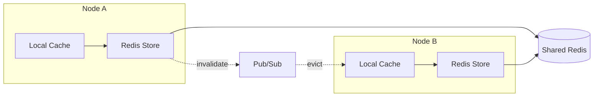

# Session

[](https://app.codacy.com/gh/azutoolkit/session?utm_source=github.com&utm_medium=referral&utm_content=azutoolkit/session&utm_campaign=Badge_Grade_Settings)

[](https://opensource.org/licenses/MIT)

**A production-ready, type-safe session management library for Crystal applications.**

Session provides enterprise-grade session handling with multiple storage backends, built-in security features, and resilience patterns. Whether you're building a simple web application or a distributed microservices architecture, Session offers the flexibility and reliability your application demands.

## Why Session?

- **Type Safety** — Define your session data as Crystal structs with compile-time guarantees
- **Multiple Backends** — Choose from Cookie, Memory, or Redis storage based on your needs
- **Security First** — AES-256 encryption, HMAC-SHA256 signatures, and configurable key derivation
- **Production Ready** — Circuit breakers, retry logic, and graceful degradation built-in
- **Developer Experience** — Clean API, comprehensive documentation, and 300+ test cases

## Table of Contents

- [Installation](#installation)
- [Quick Start](#quick-start)
- [Configuration](#configuration)
- [Storage Backends](#storage-backends)
  - [Cookie Store](#cookie-store)
  - [Memory Store](#memory-store)
  - [Redis Store](#redis-store)
- [Core Features](#core-features)
  - [Type-Safe Session Data](#type-safe-session-data)
  - [Flash Messages](#flash-messages)
  - [Session Regeneration](#session-regeneration)
  - [Sliding Expiration](#sliding-expiration)
- [Security Features](#security-features)
  - [Encryption & Signing](#encryption--signing)
  - [Key Derivation (PBKDF2)](#key-derivation-pbkdf2)
  - [Client Binding](#client-binding)
  - [Cookie Size Protection](#cookie-size-protection)
- [Resilience & Performance](#resilience--performance)
  - [Circuit Breaker](#circuit-breaker)
  - [Retry Logic](#retry-logic)
  - [Data Compression](#data-compression)
  - [Connection Pooling](#connection-pooling)
- [Clustering](#clustering)
  - [Clustered Redis Store](#clustered-redis-store)
  - [Local Cache](#local-cache)
  - [Multi-Node Setup](#multi-node-setup)
- [Observability](#observability)
- [HTTP Handler Integration](#http-handler-integration)
- [API Reference](#api-reference)
- [Contributing](#contributing)

## Installation

Add the dependency to your `shard.yml`:

```yaml
dependencies:
  session:
    github: azutoolkit/session
```

Then run:

```bash
shards install
```

## Quick Start

```crystal
require "session"

# 1. Define your session data structure
struct UserSession
  include Session::SessionData
  property user_id : Int64?
  property username : String?
  property role : String = "guest"
end

# 2. Configure the session
Session.configure do |config|
  config.secret = ENV["SESSION_SECRET"]  # Use a secure 32+ character secret
  config.timeout = 24.hours
  config.session_key = "myapp_session"
  config.provider = Session::MemoryStore(UserSession).provider
end

# 3. Use sessions in your application
provider = Session.provider
session = provider.create

session.data.user_id = 12345
session.data.username = "alice"
session.data.role = "admin"

puts session.data.username  # => "alice"
```

## Configuration

Session provides extensive configuration options to tailor behavior to your application's needs:

```crystal
Session.configure do |config|
  # Core settings
  config.secret = ENV["SESSION_SECRET"]     # Required: encryption key (32+ chars recommended)
  config.timeout = 1.hour                    # Session lifetime
  config.session_key = "_session"            # Cookie name

  # Security settings
  config.use_kdf = true                      # Enable PBKDF2 key derivation
  config.kdf_iterations = 100_000            # PBKDF2 iteration count
  config.digest_algorithm = :sha256          # HMAC algorithm (:sha256 or :sha1)
  config.require_secure_secret = true        # Enforce strong secrets in production

  # Session binding (anti-hijacking)
  config.bind_to_ip = true                   # Bind sessions to client IP
  config.bind_to_user_agent = true           # Bind sessions to User-Agent

  # Performance settings
  config.compress_data = true                # Enable gzip compression
  config.compression_threshold = 256         # Minimum bytes before compressing
  config.sliding_expiration = true           # Extend session on each request

  # Redis settings
  config.encrypt_redis_data = true           # Encrypt data stored in Redis

  # Resilience settings
  config.enable_retry = true                 # Enable automatic retry on failures
  config.circuit_breaker_enabled = true      # Enable circuit breaker pattern

  # Lifecycle callbacks
  config.on_started = ->(sid : String, data : Session::SessionData) {
    Log.info { "Session created: #{sid}" }
  }
  config.on_deleted = ->(sid : String, data : Session::SessionData) {
    Log.info { "Session destroyed: #{sid}" }
  }
end
```

## Storage Backends

Session offers three storage backends, each optimized for different use cases.

### Cookie Store

**Best for:** Simple applications, stateless deployments, serverless environments

The Cookie Store encrypts and signs session data, storing it entirely in the client's browser. Zero server-side storage required.

```crystal
Session.configure do |config|
  config.secret = ENV["SESSION_SECRET"]
  config.provider = Session::CookieStore(UserSession).provider
end
```

**Characteristics:**
- No server-side storage required
- Automatic encryption (AES-256-CBC) and signing (HMAC-SHA256)
- 4KB size limit (with automatic validation)
- Optional gzip compression for larger payloads

### Memory Store

**Best for:** Development, testing, single-server deployments

The Memory Store keeps sessions in server memory for fast access.

```crystal
Session.configure do |config|
  config.provider = Session::MemoryStore(UserSession).provider
end
```

**Characteristics:**
- Fastest possible access times
- Sessions lost on server restart
- Not suitable for multi-server deployments
- Built-in expired session cleanup

```crystal
# Manual cleanup of expired sessions
memory_store = Session::MemoryStore(UserSession).new
expired_count = memory_store.cleanup_expired

# Get memory statistics
stats = memory_store.memory_stats
puts "Total: #{stats[:total_sessions]}, Valid: #{stats[:valid_sessions]}"
```

### Redis Store

**Best for:** Production deployments, distributed systems, high availability

The Redis Store provides persistent, distributed session storage with enterprise features.

```crystal
Session.configure do |config|
  config.provider = Session::RedisStore(UserSession).provider(
    client: Redis.new(host: "localhost", port: 6379)
  )
  config.encrypt_redis_data = true  # Optional: encrypt data at rest
end
```

**Characteristics:**
- Persistent across server restarts
- Shared across multiple application instances
- Automatic TTL-based expiration
- Uses SCAN instead of KEYS for production safety
- Optional data encryption at rest
- Circuit breaker and retry logic for resilience

## Core Features

### Type-Safe Session Data

Define your session structure as a Crystal struct for compile-time type safety:

```crystal
struct UserSession
  include Session::SessionData

  property user_id : Int64?
  property username : String?
  property email : String?
  property roles : Array(String) = [] of String
  property preferences : Hash(String, String) = {} of String => String
  property login_count : Int32 = 0
  property last_seen : Time?

  def admin? : Bool
    roles.includes?("admin")
  end

  def authenticated? : Bool
    !user_id.nil?
  end
end
```

### Flash Messages

Flash messages persist for exactly one request—perfect for success notifications, error messages, and redirects:

```crystal
provider = Session.provider

# Set flash messages (available on next request)
provider.flash["notice"] = "Your changes have been saved."
provider.flash["error"] = "Please correct the errors below."

# In the next request, access flash messages
provider.flash.now["notice"]  # => "Your changes have been saved."
provider.flash.now["error"]   # => "Please correct the errors below."

# After accessing, they're automatically cleared
```

### Session Regeneration

Regenerate session IDs after authentication state changes to prevent session fixation attacks:

```crystal
provider = Session.provider

# After successful login
def login(user : User)
  provider.regenerate_id  # New session ID, same data
  provider.data.user_id = user.id
  provider.data.username = user.username
end

# After logout
def logout
  provider.delete  # Destroys the entire session
end
```

### Sliding Expiration

Automatically extend session lifetime on each request to keep active users logged in:

```crystal
Session.configure do |config|
  config.timeout = 30.minutes
  config.sliding_expiration = true  # Reset timeout on each request
end

# Check remaining session time
session = provider.current_session
remaining = session.time_until_expiry
puts "Session expires in #{remaining.total_minutes.to_i} minutes"
```

## Security Features

### Encryption & Signing

All session data is protected with industry-standard cryptography:

- **Encryption:** AES-256-CBC with random IV per encryption
- **Signing:** HMAC-SHA256 (with SHA1 fallback for migration)
- **Encoding:** URL-safe Base64

```crystal
Session.configure do |config|
  config.secret = ENV["SESSION_SECRET"]      # 32+ characters recommended
  config.digest_algorithm = :sha256          # Use SHA256 for HMAC
  config.digest_fallback = true              # Allow SHA1 during migration
end
```

### Key Derivation (PBKDF2)

Enable PBKDF2 key derivation for enhanced security against brute-force attacks:

```crystal
Session.configure do |config|
  config.use_kdf = true              # Enable key derivation
  config.kdf_iterations = 100_000    # OWASP recommended minimum
end
```

### Client Binding

Bind sessions to client characteristics to detect and prevent session hijacking:

```crystal
Session.configure do |config|
  config.bind_to_ip = true          # Validate client IP matches
  config.bind_to_user_agent = true  # Validate User-Agent matches
end
```

When a mismatch is detected, the session is automatically invalidated and a new one is created.

### Cookie Size Protection

The Cookie Store automatically validates cookie size to prevent silent failures:

```crystal
# Automatically raises CookieSizeExceededException if data exceeds 4KB
begin
  store[session.session_id] = large_session
rescue Session::CookieSizeExceededException => e
  Log.error { "Session too large: #{e.actual_size} bytes (max: #{e.max_size})" }
end
```

## Resilience & Performance

### Circuit Breaker

Protect your application from cascading failures with the circuit breaker pattern:

```crystal
Session.configure do |config|
  config.circuit_breaker_enabled = true
  config.circuit_breaker_config = Session::CircuitBreakerConfig.new(
    failure_threshold: 5,        # Open circuit after 5 failures
    reset_timeout: 30.seconds,   # Try again after 30 seconds
    half_open_max_calls: 1       # Allow 1 test request in half-open state
  )
end
```

**States:**
- **Closed:** Normal operation, requests flow through
- **Open:** Failures exceeded threshold, requests fail fast
- **Half-Open:** Testing recovery, limited requests allowed

### Retry Logic

Automatic retry with exponential backoff for transient failures:

```crystal
Session.configure do |config|
  config.enable_retry = true
  config.retry_config = Session::RetryConfig.new(
    max_attempts: 3,                    # Maximum retry attempts
    base_delay: 100.milliseconds,       # Initial delay
    max_delay: 5.seconds,               # Maximum delay cap
    backoff_multiplier: 2.0,            # Exponential backoff factor
    jitter: 0.1                         # Random jitter (±10%)
  )
end
```

### Data Compression

Reduce storage size and network transfer with automatic gzip compression:

```crystal
Session.configure do |config|
  config.compress_data = true
  config.compression_threshold = 256  # Only compress data larger than 256 bytes
end

# Check compression effectiveness
original = session_data.to_json
compressed = Session::Compression.compress(original)
ratio = Session::Compression.compression_ratio(original, compressed)
puts "Compression ratio: #{(ratio * 100).round(1)}%"
```

### Connection Pooling

For high-traffic applications, use connection pooling with Redis:

```crystal
pool = Session::ConnectionPool.new(
  size: 10,
  timeout: 5.seconds
) { Redis.new(host: "localhost") }

store = Session::PooledRedisStore(UserSession).new(pool)
```

## Clustering

Session supports multi-node deployments with Redis Pub/Sub for session invalidation and local caching for performance.

### Clustered Redis Store

The `ClusteredRedisStore` wraps `RedisStore` with local caching and cluster-wide invalidation:

```crystal
Session.configure do |config|
  config.secret = ENV["SESSION_SECRET"]

  # Enable clustering
  config.cluster.enabled = true
  config.cluster.node_id = ENV["NODE_ID"]? || UUID.random.to_s
  config.cluster.local_cache_ttl = 30.seconds
  config.cluster.local_cache_max_size = 10_000

  # Use clustered store
  config.provider = Session::ClusteredRedisStore(UserSession).new(
    client: Redis.new(host: "redis.example.com")
  )
end
```

**How it works:**



### Local Cache

Sessions are cached locally to reduce Redis load:

```crystal
# Configure cache settings
config.cluster.local_cache_enabled = true
config.cluster.local_cache_ttl = 30.seconds      # Cache entry lifetime
config.cluster.local_cache_max_size = 10_000     # Max cached sessions

# Access cache statistics
store = Session.provider.as(Session::ClusteredRedisStore(UserSession))
stats = store.cache_stats

puts "Hit rate: #{(stats.hit_rate * 100).round(1)}%"
puts "Cache size: #{stats.size}"
puts "Evictions: #{stats.evictions}"
```

### Multi-Node Setup

For production deployments with multiple application instances:

```crystal
Session.configure do |config|
  config.secret = ENV["SESSION_SECRET"]

  # Unique node identifier (use pod name in Kubernetes)
  config.cluster.enabled = true
  config.cluster.node_id = ENV["POD_NAME"]? || ENV["HOSTNAME"]? || UUID.random.to_s
  config.cluster.channel = "myapp:session:invalidate"

  config.provider = Session::ClusteredRedisStore(UserSession).new(
    client: Redis.new(url: ENV["REDIS_URL"])
  )
end

# Graceful shutdown
at_exit do
  if store = Session.config.provider.as?(Session::ClusteredRedisStore(UserSession))
    store.shutdown
  end
end
```

**Cluster Configuration Options:**

| Option | Default | Description |
|--------|---------|-------------|
| `enabled` | `false` | Enable Pub/Sub synchronization |
| `node_id` | Random UUID | Unique identifier for this node |
| `channel` | `"session:cluster:invalidate"` | Redis Pub/Sub channel |
| `local_cache_enabled` | `true` | Enable local caching |
| `local_cache_ttl` | `30.seconds` | Cache entry lifetime |
| `local_cache_max_size` | `10_000` | Maximum cached sessions |

## Observability

### Metrics

Plug in your own metrics backend for monitoring session operations:

```crystal
# Use the built-in log backend
Session.configure do |config|
  config.metrics_backend = Session::Metrics::LogBackend.new
end

# Or implement your own
class PrometheusBackend < Session::Metrics::Backend
  def increment(metric : String, tags : Hash(String, String) = {} of String => String)
    # Push to Prometheus
  end

  def timing(metric : String, duration : Time::Span, tags : Hash(String, String) = {} of String => String)
    # Record timing histogram
  end

  def gauge(metric : String, value : Float64, tags : Hash(String, String) = {} of String => String)
    # Set gauge value
  end
end

Session.configure do |config|
  config.metrics_backend = PrometheusBackend.new
end
```

### Query Interface

Query and manage sessions programmatically:

```crystal
store = Session::MemoryStore(UserSession).new

# Iterate all valid sessions
store.each_session do |session|
  puts "User: #{session.data.username}"
end

# Find sessions matching criteria
admin_sessions = store.find_by { |s| s.data.roles.includes?("admin") }

# Bulk delete sessions
deleted = store.bulk_delete { |s| s.data.user_id == compromised_user_id }
puts "Revoked #{deleted} sessions"

# Get all session IDs
all_ids = store.all_session_ids
```

## HTTP Handler Integration

Integrate Session into your HTTP pipeline with the built-in handler:

```crystal
require "http/server"

# Configure session
Session.configure do |config|
  config.secret = ENV["SESSION_SECRET"]
  config.provider = Session::MemoryStore(UserSession).provider
end

# Create the handler chain
session_handler = Session::SessionHandler.new(Session.provider)

server = HTTP::Server.new([
  session_handler,
  YourApplicationHandler.new,
])

server.listen(8080)
```

The handler automatically:
- Loads session from request cookies
- Validates session binding (if enabled)
- Handles corrupted/expired sessions gracefully
- Sets updated session cookie on response
- Extends session lifetime (if sliding expiration enabled)

## API Reference

### Provider Methods

```crystal
provider = Session.provider

provider.create                    # Create a new session
provider.delete                    # Destroy the current session
provider.regenerate_id             # Generate new session ID (keeps data)
provider.valid?                    # Check if session is valid
provider.session_id                # Get current session ID
provider.current_session           # Get current SessionId object
provider.data                      # Access session data (type-safe)
provider.flash                     # Access flash messages

provider.load_from(cookies)        # Load session from HTTP cookies
provider.set_cookies(cookies)      # Set session cookie in response
provider.create_session_cookie     # Generate a session cookie

provider[session_id]               # Get session by ID (raises if not found)
provider[session_id]?              # Get session by ID (returns nil if not found)
provider.clear                     # Remove all sessions from store
```

### Session Object

```crystal
session = provider.current_session

session.session_id                 # Unique session identifier
session.data                       # Your SessionData struct
session.created_at                 # When the session was created
session.expires_at                 # When the session expires
session.valid?                     # Check if not expired
session.expired?                   # Check if expired
session.time_until_expiry          # Time remaining until expiration
session.touch                      # Extend expiration (sliding expiration)
```

## Roadmap

- [ ] PostgreSQL session store
- [ ] MySQL session store
- [ ] MongoDB session store
- [x] Session clustering and synchronization
- [x] Cookie-based storage with encryption
- [x] Redis storage with SCAN optimization
- [x] Circuit breaker pattern
- [x] Flash messages
- [x] Session regeneration
- [x] Client binding (IP/User-Agent)
- [x] Data compression
- [x] Metrics integration

## Contributing

We welcome contributions! Here's how to get started:

1. Fork the repository
2. Create your feature branch (`git checkout -b feature/amazing-feature`)
3. Write tests for your changes
4. Ensure all tests pass (`crystal spec`)
5. Commit your changes (`git commit -am 'Add amazing feature'`)
6. Push to the branch (`git push origin feature/amazing-feature`)
7. Open a Pull Request

Please ensure your code follows the existing style and includes appropriate test coverage.

## License

This project is licensed under the MIT License - see the [LICENSE](LICENSE) file for details.

## Contributors

- [Elias J. Perez](https://github.com/eliasjpr) - Creator and maintainer

---

**Give a ⭐️ if Session helps your project!**
