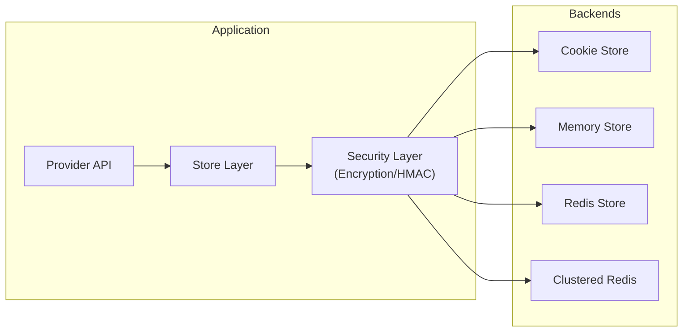

# Session

**A production-ready, type-safe session management library for Crystal applications.**

Session provides enterprise-grade session handling with multiple storage backends, built-in security features, and resilience patterns. Whether you're building a simple web application or a distributed microservices architecture, Session offers the flexibility and reliability your application demands.

## Why Session?

* **Type Safety** - Define your session data as Crystal structs with compile-time guarantees
* **Multiple Backends** - Choose from Cookie, Memory, Redis, or Clustered Redis storage
* **Security First** - AES-256 encryption, HMAC-SHA256 signatures, and configurable key derivation
* **Production Ready** - Circuit breakers, retry logic, and graceful degradation built-in
* **Clustering Support** - Multi-node session synchronization with Redis Pub/Sub
* **Developer Experience** - Clean API, comprehensive documentation, and extensive test coverage

## Features at a Glance

| Feature | Description |
|---------|-------------|
| Type-Safe Sessions | Define session data as Crystal structs |
| Multiple Storage Backends | Cookie, Memory, Redis, Clustered Redis |
| Session Clustering | Multi-node synchronization via Redis Pub/Sub |
| Local Caching | Configurable TTL-based cache with LRU eviction |
| Encryption | AES-256-CBC encryption with HMAC-SHA256 signing |
| Key Derivation | PBKDF2-SHA256 for enhanced security |
| Client Binding | Bind sessions to IP and/or User-Agent |
| Flash Messages | One-request-only message storage |
| Circuit Breaker | Prevent cascading failures |
| Retry Logic | Exponential backoff with jitter |
| Compression | Gzip compression for large payloads |
| Connection Pooling | Efficient Redis connection management |
| Metrics | Pluggable metrics backend |

## Quick Example

```crystal
require "session"

# Define your session data
struct UserSession
  include Session::SessionData
  property user_id : Int64?
  property username : String?
  property role : String = "guest"
end

# Configure session management
Session.configure do |config|
  config.secret = ENV["SESSION_SECRET"]
  config.timeout = 24.hours
  config.provider = Session::RedisStore(UserSession).provider(
    client: Redis.new
  )
end

# Use sessions
provider = Session.provider
session = provider.create
session.data.user_id = 12345
session.data.username = "alice"
```

## Architecture Overview



## Framework Integrations

Session integrates with popular Crystal web frameworks:

- **[AZU Framework](integrations/azu-framework.md)** - Type-safe endpoint integration with helper modules
- **[HTTP::Server](integrations/http-server.md)** - Crystal's built-in HTTP server

## Recent Improvements (2026-02-07)

Session has recently undergone a comprehensive architecture overhaul, resulting in:

- **~460 lines removed** (net ~320 after improvements)
- **100% test coverage maintained** (346/346 passing)
- **Zero breaking changes**
- **Significantly improved maintainability**

Key improvements include:
- **Code Quality**: Eliminated all duplication through RedisUtils module
- **Developer Experience**: Configuration presets reduce setup by 71%
- **Store Consolidation**: Unified Redis stores, removing 90% of duplicate code
- **Provider Simplification**: Removed all macro magic for better debuggability

See the [Architecture & Improvements](architecture/overview.md) section for complete details.

## Getting Started

Continue to the [Installation](getting-started/installation.md) guide to add Session to your project.
