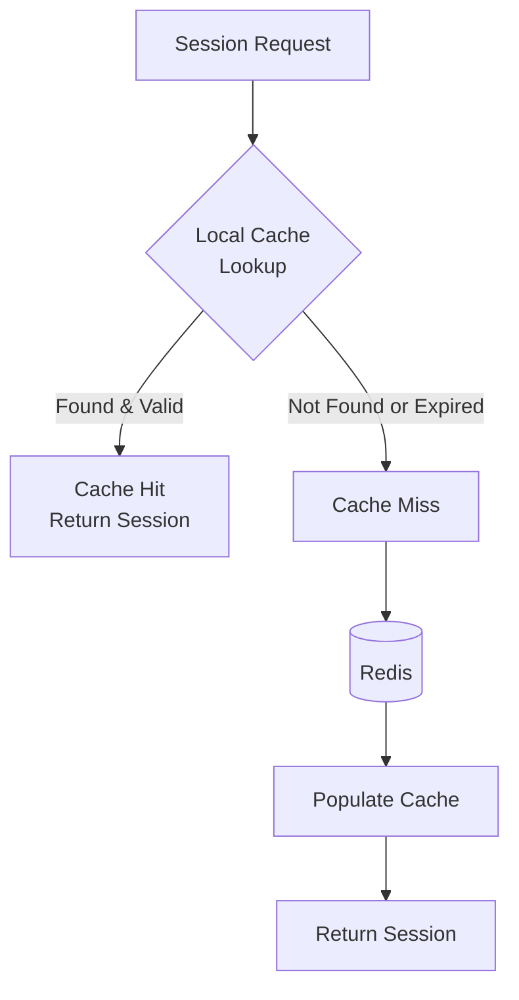
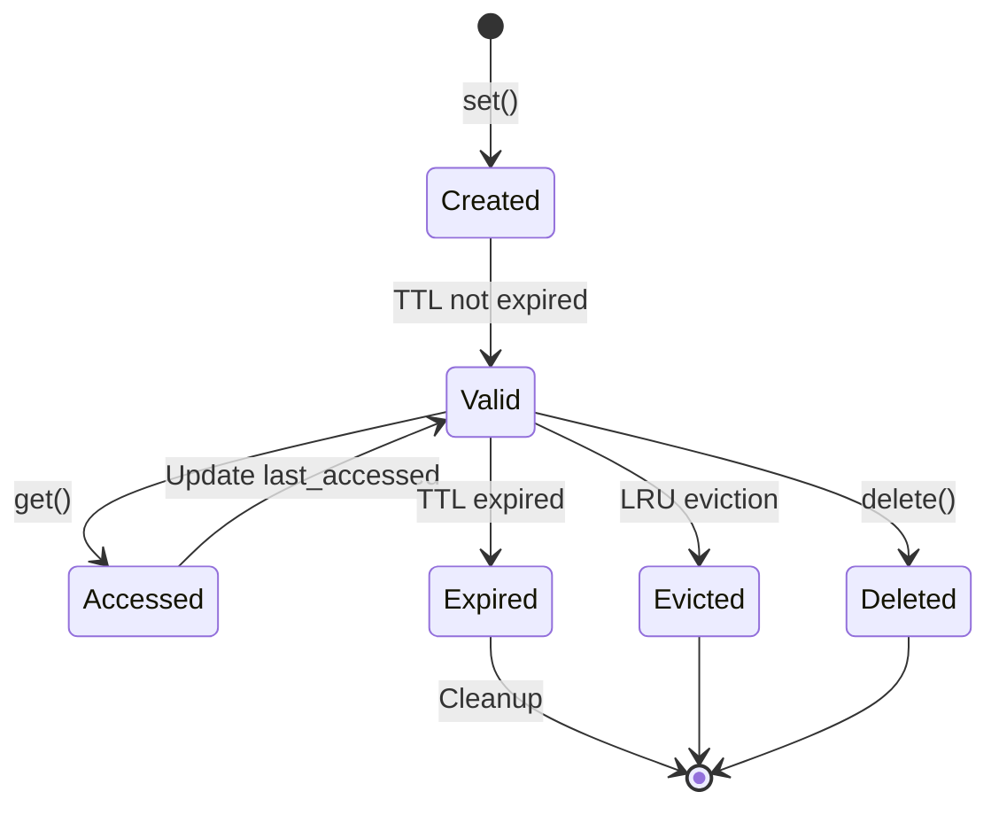
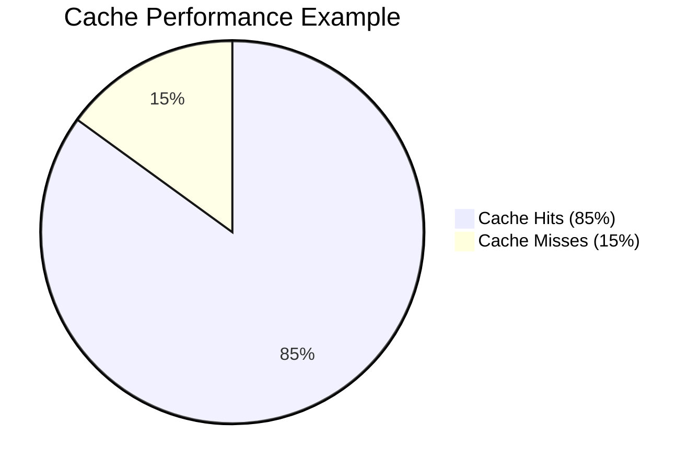

# Local Cache

The local cache is an in-memory caching layer that reduces Redis load by storing frequently accessed sessions locally on each application node.

## How It Works



## Cache Entry Lifecycle



## Configuration

```crystal
Session.configure do |config|
  config.cluster.local_cache_enabled = true
  config.cluster.local_cache_ttl = 30.seconds
  config.cluster.local_cache_max_size = 10_000
end
```

### TTL (Time-To-Live)

Each cache entry has a TTL after which it's considered expired:

| TTL Value | Use Case |
|-----------|----------|
| `5.seconds` | Near real-time consistency needed |
| `30.seconds` | Default, good balance |
| `1.minute` | High traffic, stable sessions |
| `5.minutes` | Very high traffic, infrequent changes |

### Max Size and LRU Eviction

When the cache reaches `max_size`:

1. **Expired entries** are removed first
2. **LRU eviction** removes least recently accessed entries

```crystal
# Memory estimation
# Each entry ≈ 1-5 KB depending on session data size
config.cluster.local_cache_max_size = 10_000   # ~10-50 MB
config.cluster.local_cache_max_size = 100_000  # ~100-500 MB
```

## Cache Statistics

Access cache statistics programmatically:

```crystal
store = Session::ClusteredRedisStore(UserSession).new(client: Redis.new)

# Get cache statistics
stats = store.cache_stats

puts "Hits: #{stats.hits}"
puts "Misses: #{stats.misses}"
puts "Evictions: #{stats.evictions}"
puts "Size: #{stats.size}"
puts "Hit Rate: #{(stats.hit_rate * 100).round(2)}%"
```

### Understanding Hit Rate



A healthy cache should have:
- **Hit rate > 80%** for typical web applications
- **Hit rate > 90%** for read-heavy applications

Low hit rate indicates:
- TTL is too short
- Cache size is too small
- Sessions are being invalidated frequently

## Cache Invalidation

### Automatic Invalidation

The cache is automatically invalidated when:

1. **Entry expires** (TTL exceeded)
2. **Session deleted** (via `store.delete`)
3. **Cluster message received** (from another node)
4. **Cache cleared** (via `store.clear`)

### Manual Cache Operations

```crystal
store = Session::ClusteredRedisStore(UserSession).new(client: Redis.new)

# Evict a specific session from local cache only
# (doesn't delete from Redis or broadcast)
store.evict_from_cache(session_id)

# Access the local cache directly
cache = store.coordinator.local_cache

# Get current size
puts cache.size

# Clear entire cache
cache.clear

# Reset statistics
cache.reset_stats
```

## Thread Safety

The `LocalCache` class is thread-safe:

- All operations are protected by a `Mutex`
- Safe to use from multiple fibers
- No external synchronization required

```crystal
# Safe to use concurrently
spawn { store[session_id] }
spawn { store[session_id] = session }
spawn { store.delete(session_id) }
```

## Memory Management

### Estimating Memory Usage

```crystal
# Approximate formula:
# Memory = entries × average_session_size

# Example:
# 10,000 entries × 2 KB average = 20 MB
# 100,000 entries × 2 KB average = 200 MB
```

### Monitoring Memory

```crystal
# Periodic monitoring
spawn do
  loop do
    stats = store.cache_stats
    Log.info { "Cache size: #{stats.size}, hit rate: #{stats.hit_rate}" }
    sleep 1.minute
  end
end
```

## Best Practices

### 1. Size Your Cache Appropriately

```crystal
# Calculate based on:
# - Expected concurrent users
# - Session access patterns
# - Available memory

# Rule of thumb: cache 2-3x your peak concurrent users
active_users = 5000
config.cluster.local_cache_max_size = active_users * 3
```

### 2. Set TTL Based on Session Update Frequency

```crystal
# Sessions updated every request → shorter TTL
config.cluster.local_cache_ttl = 10.seconds

# Sessions rarely updated → longer TTL
config.cluster.local_cache_ttl = 2.minutes
```

### 3. Monitor Cache Performance

```crystal
# Track hit rate over time
# Alert if hit rate drops below threshold
if stats.hit_rate < 0.7
  Log.warn { "Cache hit rate below 70%: #{stats.hit_rate}" }
end
```

### 4. Consider Disabling for Specific Use Cases

```crystal
# Disable caching when consistency is critical
config.cluster.local_cache_enabled = false

# Or use very short TTL
config.cluster.local_cache_ttl = 1.second
```
