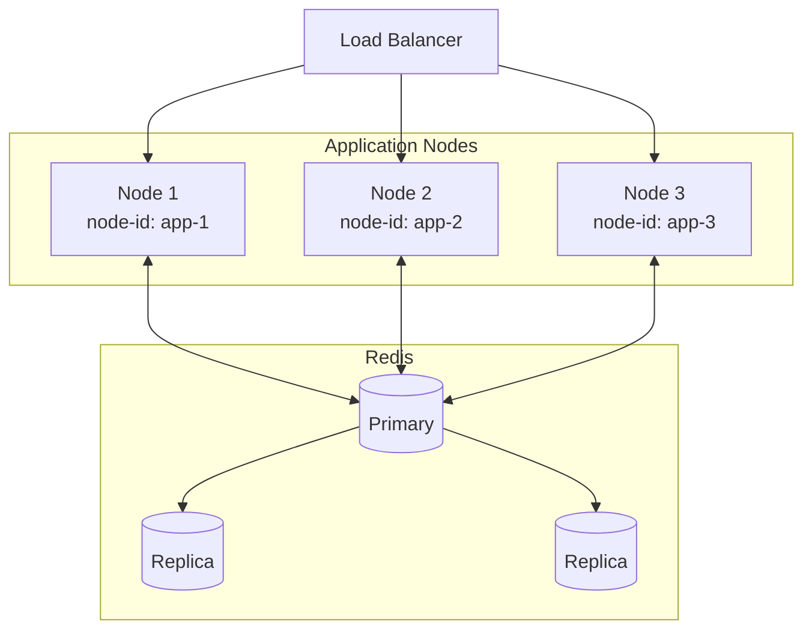
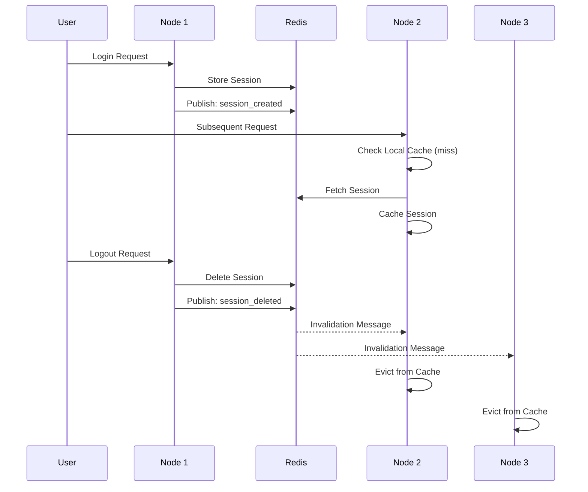
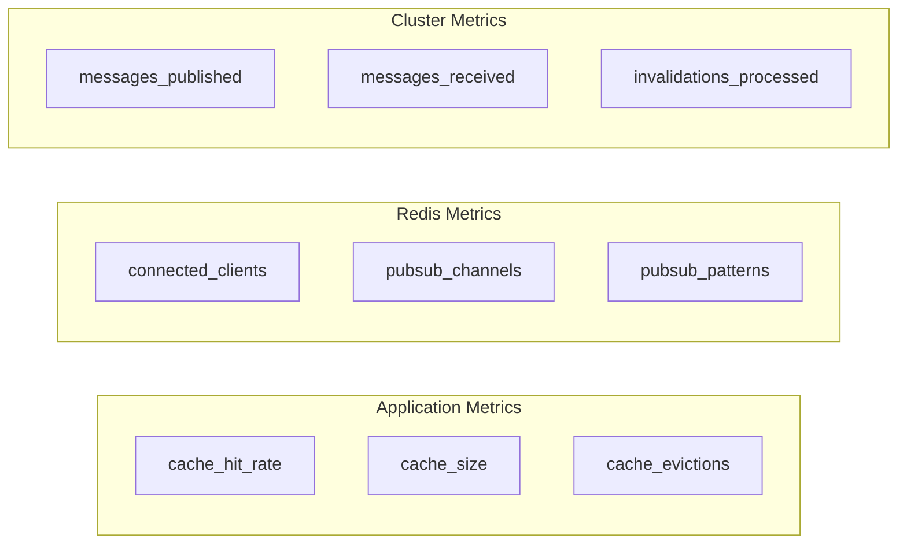

# Multi-Node Setup

This guide covers deploying session clustering in a production multi-node environment.

## Deployment Architecture



## Prerequisites

- Redis 5.0+ (for reliable Pub/Sub)
- All application nodes can reach Redis
- Unique node identifiers for each instance

## Configuration by Environment

### Docker Compose

```yaml
# docker-compose.yml
version: '3.8'

services:
  redis:
    image: redis:7-alpine
    ports:
      - "6379:6379"
    volumes:
      - redis_data:/data

  app1:
    build: .
    environment:
      - NODE_ID=app-node-1
      - REDIS_URL=redis://redis:6379
      - SESSION_SECRET=${SESSION_SECRET}
    depends_on:
      - redis

  app2:
    build: .
    environment:
      - NODE_ID=app-node-2
      - REDIS_URL=redis://redis:6379
      - SESSION_SECRET=${SESSION_SECRET}
    depends_on:
      - redis

  nginx:
    image: nginx:alpine
    ports:
      - "80:80"
    volumes:
      - ./nginx.conf:/etc/nginx/nginx.conf
    depends_on:
      - app1
      - app2

volumes:
  redis_data:
```

### Kubernetes

```yaml
# deployment.yaml
apiVersion: apps/v1
kind: Deployment
metadata:
  name: myapp
spec:
  replicas: 3
  selector:
    matchLabels:
      app: myapp
  template:
    metadata:
      labels:
        app: myapp
    spec:
      containers:
      - name: app
        image: myapp:latest
        env:
        - name: NODE_ID
          valueFrom:
            fieldRef:
              fieldPath: metadata.name  # Uses pod name
        - name: REDIS_URL
          value: "redis://redis-master:6379"
        - name: SESSION_SECRET
          valueFrom:
            secretKeyRef:
              name: app-secrets
              key: session-secret
---
apiVersion: v1
kind: Service
metadata:
  name: myapp
spec:
  selector:
    app: myapp
  ports:
  - port: 80
    targetPort: 8080
```

### Application Configuration

```crystal
# config/session.cr
Session.configure do |config|
  config.secret = ENV["SESSION_SECRET"]
  config.timeout = 24.hours

  # Clustering configuration
  config.cluster.enabled = true
  config.cluster.node_id = ENV["NODE_ID"]? || ENV["HOSTNAME"]? || UUID.random.to_s
  config.cluster.channel = "#{ENV["APP_NAME"]?}:session:invalidate"
  config.cluster.local_cache_ttl = 30.seconds
  config.cluster.local_cache_max_size = 50_000

  # Redis connection
  redis_url = ENV["REDIS_URL"]? || "redis://localhost:6379"
  redis = Redis.new(url: redis_url)

  config.store = Session::ClusteredRedisStore(UserSession).new(
    client: redis
  )
end
```

## Node ID Strategies

### Using Environment Variables

```crystal
# Explicit environment variable
config.cluster.node_id = ENV["NODE_ID"]
```

### Using Hostname

```crystal
# System hostname
config.cluster.node_id = System.hostname
```

### Using Kubernetes Pod Name

```crystal
# Pod name from downward API
config.cluster.node_id = ENV["POD_NAME"]? || System.hostname
```

### Generating Unique ID

```crystal
# Combine multiple identifiers
config.cluster.node_id = "#{System.hostname}-#{Process.pid}-#{Time.utc.to_unix}"
```

## Message Flow



## Health Checks

### Application Health Check

```crystal
# Add health check endpoint
get "/health" do
  store = Session.config.store.not_nil!.as(Session::ClusteredRedisStore(UserSession))

  health = {
    redis: store.healthy?,
    coordinator_running: store.coordinator.running?,
    cache_size: store.coordinator.local_cache.size,
  }

  if health[:redis] && health[:coordinator_running]
    json health, status: 200
  else
    json health, status: 503
  end
end
```

### Kubernetes Probes

```yaml
livenessProbe:
  httpGet:
    path: /health
    port: 8080
  initialDelaySeconds: 10
  periodSeconds: 30

readinessProbe:
  httpGet:
    path: /health
    port: 8080
  initialDelaySeconds: 5
  periodSeconds: 10
```

## Graceful Shutdown

```crystal
# Handle shutdown signals
Signal::INT.trap do
  Log.info { "Shutting down..." }

  # Stop the cluster coordinator
  if store = Session.config.store
    if clustered = store.as?(Session::ClusteredRedisStore(UserSession))
      clustered.shutdown
    end
  end

  exit 0
end

Signal::TERM.trap do
  # Same as above
end
```

## Monitoring

### Metrics to Track



### Prometheus Metrics Example

```crystal
# Custom metrics backend
class PrometheusSessionMetrics < Session::Metrics::Backend
  def increment(name : String, tags : Hash(String, String) = {} of String => String)
    labels = tags.map { |k, v| "#{k}=\"#{v}\"" }.join(",")
    # Push to Prometheus
  end
end

Session.configure do |config|
  config.metrics_backend = PrometheusSessionMetrics.new
end
```

## Troubleshooting

### Sessions Not Syncing

1. **Check Redis connectivity** from all nodes
2. **Verify channel name** is identical across nodes
3. **Check node_id** is unique per node
4. **Verify Pub/Sub** is working:

```bash
# In one terminal
redis-cli SUBSCRIBE session:cluster:invalidate

# In another terminal
redis-cli PUBLISH session:cluster:invalidate '{"test": true}'
```

### High Cache Miss Rate

1. **Increase cache size** if evictions are high
2. **Increase TTL** if sessions aren't changing frequently
3. **Check invalidation frequency** - too many invalidations?

### Memory Issues

1. **Reduce cache size**: `local_cache_max_size`
2. **Reduce TTL**: Forces more frequent eviction
3. **Monitor with**: `store.cache_stats`

### Redis Connection Issues

1. **Enable circuit breaker** to prevent cascading failures
2. **Configure retry logic** for transient errors
3. **Use connection pooling** for high-traffic apps

```crystal
Session.configure do |config|
  config.circuit_breaker_enabled = true
  config.enable_retry = true
end
```

## Best Practices

### 1. Use Consistent Node IDs

Ensure node IDs persist across restarts to avoid duplicate subscriptions:

```crystal
# Good: Environment variable or hostname
config.cluster.node_id = ENV["NODE_ID"]

# Avoid: Random UUID on each start
config.cluster.node_id = UUID.random.to_s  # New ID each restart
```

### 2. Size Cache for Peak Load

```crystal
# Calculate based on peak concurrent sessions
peak_sessions = 10_000
cache_multiplier = 1.5  # Some headroom
config.cluster.local_cache_max_size = (peak_sessions * cache_multiplier).to_i
```

### 3. Use Separate Redis for Sessions

```crystal
# Dedicated Redis instance for sessions
session_redis = Redis.new(host: "session-redis.internal")
```

### 4. Enable Encryption for Sensitive Data

```crystal
config.encrypt_redis_data = true
```

### 5. Implement Graceful Degradation

```crystal
# Application continues working even if clustering fails
begin
  store = Session::ClusteredRedisStore(UserSession).new(client: redis)
rescue ex
  Log.error { "Failed to initialize clustered store: #{ex.message}" }
  store = Session::RedisStore(UserSession).new(client: redis)
end
```
