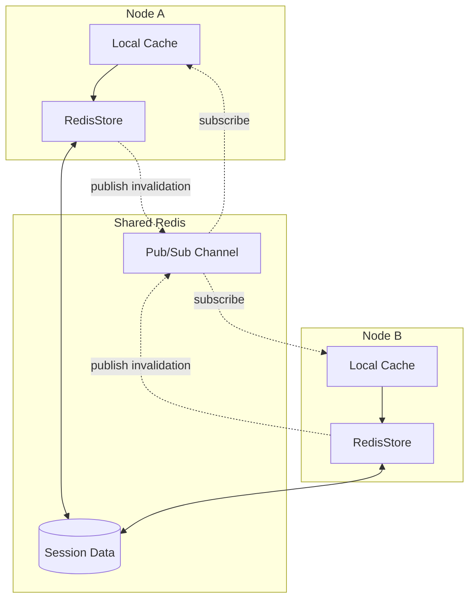

# Session Clustering Overview

Session clustering enables multi-node deployments where multiple application instances share session state through Redis with local caching for performance.

## Architecture



## How It Works

### Request Flow

1. **Request arrives** at Node A
2. **Check local cache** - if hit, return cached session immediately
3. **Cache miss** - fetch from Redis, populate local cache
4. **On session delete** - remove from local cache + publish invalidation
5. **Other nodes receive invalidation** - evict from their local caches

### Consistency Model

The clustering implementation uses **eventual consistency** with the following characteristics:

| Aspect | Behavior |
|--------|----------|
| Reads | Local cache first, Redis fallback |
| Writes | Redis immediately, local cache updated |
| Deletes | Redis + local cache + broadcast invalidation |
| Propagation | Async via Redis Pub/Sub |
| Delivery | Best-effort (fire-and-forget) |

## Key Components

### ClusteredRedisStore

The main store class that wraps `RedisStore` with clustering capabilities:

```crystal
store = Session::ClusteredRedisStore(UserSession).new(
  client: Redis.new,
  config: Session::ClusterConfig.new(enabled: true)
)
```

### ClusterCoordinator

Manages the background Pub/Sub subscription and local cache:

- Subscribes to invalidation channel in a background fiber
- Broadcasts invalidation messages when sessions are deleted
- Maintains the local cache with TTL and LRU eviction

### LocalCache

A thread-safe, in-memory cache with:

- Configurable TTL (time-to-live)
- LRU (least recently used) eviction when at max size
- Cache statistics (hits, misses, evictions)

## When to Use Clustering

### Use Clustering When

- Running multiple application instances behind a load balancer
- Session reads significantly outnumber writes
- You want to reduce Redis load with local caching
- You need session invalidation to propagate across nodes

### Don't Use Clustering When

- Running a single application instance
- Sessions are very short-lived
- You need strong consistency guarantees
- Your application doesn't use Redis

## Quick Start

```crystal
Session.configure do |config|
  config.secret = ENV["SESSION_SECRET"]

  # Enable clustering
  config.cluster.enabled = true
  config.cluster.node_id = ENV["NODE_ID"]? || UUID.random.to_s
  config.cluster.local_cache_ttl = 30.seconds
  config.cluster.local_cache_max_size = 10_000

  # Use clustered store
  config.store = Session::ClusteredRedisStore(UserSession).new(
    client: Redis.new(host: "redis.example.com")
  )
end
```

## Performance Benefits

| Scenario | Without Clustering | With Clustering |
|----------|-------------------|-----------------|
| Session read (cached) | Redis RTT (~1-5ms) | Memory access (~0.01ms) |
| Session read (miss) | Redis RTT (~1-5ms) | Redis RTT + cache population |
| Session write | Redis RTT (~1-5ms) | Redis RTT + cache update |
| Session delete | Redis RTT (~1-5ms) | Redis RTT + Pub/Sub broadcast |

With a typical cache hit rate of 80-90%, you can reduce Redis load by 80-90% for read operations.

## Next Steps

- [Configuration](configuration.md) - Detailed configuration options
- [Local Cache](local-cache.md) - Understanding the caching layer
- [Multi-Node Setup](multi-node-setup.md) - Production deployment guide
