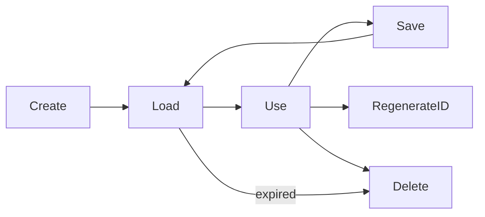

# Session Lifecycle

Sessions follow a predictable lifecycle from creation through expiration or deletion. The store manages this lifecycle and triggers callbacks at each stage.



## Creating Sessions

```crystal
session = store.create
```

Creates a new `T.new`, stores it, and triggers the `:started` callback. The session is assigned a random UUID and an expiration time based on `config.timeout`.

## Loading Sessions

```crystal
store.load_from(request.cookies)
```

Reads the session ID from the request cookie, deserializes the session from the store, and sets it as the current session. If `sliding_expiration` is enabled, the session's expiration is automatically extended. Triggers the `:loaded` callback. Flash messages are rotated at the start of each load.

## Accessing Session Data

```crystal
store.current_session              # Current session object (your typed class)
store[session_id]                  # Fetch by ID (raises SessionNotFoundException)
store[session_id]?                 # Fetch by ID (returns nil)
store.session_id                   # Current session's ID
store.valid?                       # Current session not expired?
```

## Saving Sessions

```crystal
store.set_cookies(response.cookies, request.hostname.to_s)
```

Sets the session cookie on the response and persists the current session to the store. Triggers the `:client` callback.

## Regenerating Session ID

```crystal
store.regenerate_id
```

Deletes the old session, generates a new session ID (via `reset_identity!`), and stores the session with the new ID. All user data is preserved. Triggers `on_regenerated` with both old and new IDs.

Call this after authentication state changes (login, privilege escalation) to prevent session fixation attacks.

## Deleting Sessions

```crystal
store.delete                       # Delete current session + create fresh one
store.delete(session_id)           # Delete a specific session by ID
```

The no-argument form deletes the current session, triggers the `:deleted` callback, and creates a fresh empty session.

## Expiration

```crystal
session.expired?                   # Past expiration time?
session.valid?                     # Not expired?
session.time_until_expiry          # Remaining Time::Span (zero if expired)
session.touch                      # Reset expiration to timeout.from_now
```

When `config.sliding_expiration = true`, `touch` is called automatically on each `load_from`, extending the session on every request.

## Callbacks

Configure callbacks to observe session lifecycle events:

| Callback | Signature | Triggered When |
|----------|-----------|----------------|
| `on_started` | `(String, Session::Base) -> Nil` | Session created |
| `on_loaded` | `(String, Session::Base) -> Nil` | Session loaded from request |
| `on_client` | `(String, Session::Base) -> Nil` | Session saved to response |
| `on_deleted` | `(String, Session::Base) -> Nil` | Session deleted |
| `on_regenerated` | `(String, String, Session::Base) -> Nil` | Session ID regenerated (old_id, new_id) |

```crystal
Session.configure do |config|
  config.on_started = ->(id : String, session : Session::Base) {
    Log.info { "Session #{id} created" }
  }
end
```

## See Also

- [Store API](../api/store.md) -- Full store method reference
- [Type-Safe Sessions](type-safe-sessions.md) -- Defining session classes
