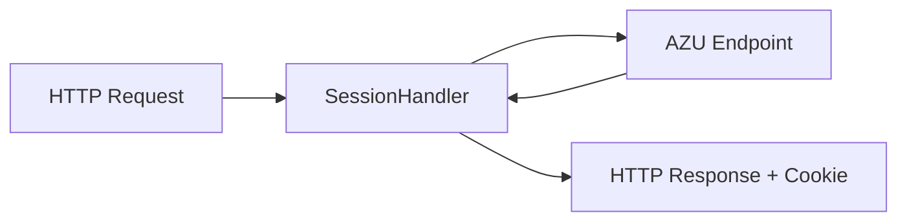

# AZU Framework Integration

Integrate Session with the [AZU web framework](https://github.com/azutoolkit/azu) for type-safe session management in your Crystal applications.

## Overview



## Installation

Add both dependencies to your `shard.yml`:

```yaml
dependencies:
  azu:
    github: azutoolkit/azu
  session:
    github: azutoolkit/session
```

## Quick Start

### 1. Define Your Session Data

```crystal
# src/sessions/user_session.cr
class UserSession < Session::Base
  property user_id : Int64?
  property username : String?
  property email : String?
  property roles : Array(String) = [] of String
  property logged_in_at : Time?

  def authenticated? : Bool
    !user_id.nil?
  end

  def admin? : Bool
    roles.includes?("admin")
  end
end
```

### 2. Configure Session

```crystal
# src/config/session.cr
require "session"

Session.configure do |config|
  config.secret = ENV["SESSION_SECRET"]
  config.timeout = 24.hours
  config.session_key = "myapp_session"
  config.sliding_expiration = true

  # Use Redis for production
  if Azu.env.production?
    config.store = Session::RedisStore(UserSession).new(
      client: Redis.new(url: ENV["REDIS_URL"])
    )
  else
    config.store = Session::MemoryStore(UserSession).new
  end
end
```

### 3. Create the Session Handler

```crystal
# src/handlers/session_handler.cr
class AzuSessionHandler
  include HTTP::Handler

  def initialize(@store : Session::MemoryStore(UserSession))
  end

  def call(context : HTTP::Server::Context)
    # Load session from cookies
    @store.load_from(context.request.cookies)

    # Store store in context for endpoint access
    context.set("session_store", @store)

    # Process request
    call_next(context)

    # Set session cookie in response
    @store.set_cookies(context.response.cookies)
  rescue Session::SessionExpiredException
    # Handle expired session - create new one
    @store.create
    call_next(context)
    @store.set_cookies(context.response.cookies)
  rescue Session::SessionCorruptionException
    # Handle corrupted session - create new one
    @store.create
    call_next(context)
    @store.set_cookies(context.response.cookies)
  end
end
```

### 4. Register the Handler

```crystal
# src/app.cr
require "azu"
require "./config/session"
require "./handlers/session_handler"

Azu.configure do
  port = ENV.fetch("PORT", "4000").to_i
end

store = Session.config.store.not_nil!

Azu.start [
  Azu::Handler::RequestId.new,
  Azu::Handler::Rescuer.new,
  AzuSessionHandler.new(store),  # Add session handler
  Azu::Handler::Logger.new,
]
```

### 5. Use Sessions in Endpoints

```crystal
# src/endpoints/login_endpoint.cr
struct LoginEndpoint
  include Azu::Endpoint(LoginRequest, LoginResponse)
  post "/login"

  def call : LoginResponse
    # Get session store from context
    store = context.get("session_store").as(Session::MemoryStore(UserSession))

    # Authenticate user
    user = authenticate(request.email, request.password)

    if user
      # Regenerate session ID after login (security best practice)
      store.regenerate_id

      # Set session data
      store.current_session.user_id = user.id
      store.current_session.username = user.username
      store.current_session.email = user.email
      store.current_session.roles = user.roles
      store.current_session.logged_in_at = Time.utc

      # Set flash message
      store.flash["notice"] = "Welcome back, #{user.username}!"

      LoginResponse.new(success: true, message: "Logged in successfully")
    else
      store.flash["error"] = "Invalid credentials"
      LoginResponse.new(success: false, message: "Invalid email or password")
    end
  end

  private def authenticate(email : String, password : String) : User?
    # Your authentication logic
  end
end
```

## Helper Module

Create a helper module to simplify session access in endpoints:

```crystal
# src/helpers/session_helper.cr
module SessionHelper
  def session_store : Session::MemoryStore(UserSession)
    context.get("session_store").as(Session::MemoryStore(UserSession))
  end

  def current_session : UserSession
    session_store.current_session
  end

  def flash : Session::Flash
    session_store.flash
  end

  def authenticated? : Bool
    current_session.authenticated?
  end

  def current_user_id : Int64?
    current_session.user_id
  end

  def require_authentication! : Nil
    unless authenticated?
      raise Azu::Unauthorized.new("Authentication required")
    end
  end

  def require_admin! : Nil
    require_authentication!
    unless current_session.admin?
      raise Azu::Forbidden.new("Admin access required")
    end
  end
end
```

Use the helper in your endpoints:

```crystal
struct ProfileEndpoint
  include Azu::Endpoint(EmptyRequest, ProfileResponse)
  include SessionHelper
  get "/profile"

  def call : ProfileResponse
    require_authentication!

    user = User.find(current_user_id)
    ProfileResponse.new(user)
  end
end

struct AdminDashboardEndpoint
  include Azu::Endpoint(EmptyRequest, DashboardResponse)
  include SessionHelper
  get "/admin/dashboard"

  def call : DashboardResponse
    require_admin!

    stats = AdminService.get_dashboard_stats
    DashboardResponse.new(stats)
  end
end
```

## Logout Endpoint

```crystal
struct LogoutEndpoint
  include Azu::Endpoint(EmptyRequest, LogoutResponse)
  include SessionHelper
  post "/logout"

  def call : LogoutResponse
    if authenticated?
      username = current_session.username
      session_store.delete  # Destroy session
      flash["notice"] = "Goodbye, #{username}!"
    end

    LogoutResponse.new(success: true)
  end
end
```

## Flash Messages in Templates

Access flash messages in your views:

```crystal
# src/endpoints/home_endpoint.cr
struct HomeEndpoint
  include Azu::Endpoint(EmptyRequest, HomeResponse)
  include SessionHelper
  get "/"

  def call : HomeResponse
    HomeResponse.new(
      flash_notice: flash.now["notice"]?,
      flash_error: flash.now["error"]?,
      user: authenticated? ? current_session.username : nil
    )
  end
end
```

```html
<!-- src/templates/home.jinja -->

  <div class="alert alert-success">{{ flash_notice }}</div>



  <div class="alert alert-danger">{{ flash_error }}</div>



  <p>Welcome, {{ user }}!</p>

  <p>Please <a href="/login">log in</a>.</p>

```

## Production Configuration

### With Redis and Clustering

```crystal
Session.configure do |config|
  config.secret = ENV["SESSION_SECRET"]
  config.timeout = 24.hours
  config.session_key = "myapp_session"

  # Security settings
  config.use_kdf = true
  config.kdf_iterations = 100_000
  config.bind_to_ip = true
  config.bind_to_user_agent = true
  config.sliding_expiration = true

  # Resilience
  config.enable_retry = true
  config.circuit_breaker_enabled = true

  # Clustering for multi-node deployments
  config.cluster.enabled = true
  config.cluster.node_id = ENV["POD_NAME"]? || ENV["HOSTNAME"]? || UUID.random.to_s
  config.cluster.local_cache_ttl = 30.seconds
  config.cluster.local_cache_max_size = 10_000

  config.store = Session::ClusteredRedisStore(UserSession).new(
    client: Redis.new(url: ENV["REDIS_URL"])
  )
end
```

### With Cookie Store (Stateless)

For serverless or edge deployments:

```crystal
Session.configure do |config|
  config.secret = ENV["SESSION_SECRET"]
  config.timeout = 24.hours
  config.compress_data = true  # Keep cookies small

  config.store = Session::CookieStore(UserSession).new
end
```

## Testing

### Test Helper

```crystal
# spec/support/session_helper.cr
def with_session(data : UserSession? = nil, &)
  store = Session::MemoryStore(UserSession).new
  store.create

  if data
    store.current_session.user_id = data.user_id
    store.current_session.username = data.username
    store.current_session.roles = data.roles
  end

  yield store
end

def authenticated_session(user : User) : Session::MemoryStore(UserSession)
  store = Session::MemoryStore(UserSession).new
  store.create
  store.current_session.user_id = user.id
  store.current_session.username = user.username
  store.current_session.roles = user.roles
  store
end
```

### Endpoint Tests

```crystal
# spec/endpoints/profile_endpoint_spec.cr
require "./spec_helper"

describe ProfileEndpoint do
  it "returns profile for authenticated user" do
    user = User.create(username: "alice", email: "alice@example.com")

    with_session do |store|
      store.current_session.user_id = user.id
      store.current_session.username = user.username

      # Mock the context with session store
      context = create_test_context("/profile")
      context.set("session_store", store)

      endpoint = ProfileEndpoint.new(context)
      response = endpoint.call

      response.username.should eq("alice")
    end
  end

  it "rejects unauthenticated requests" do
    with_session do |store|
      context = create_test_context("/profile")
      context.set("session_store", store)

      endpoint = ProfileEndpoint.new(context)

      expect_raises(Azu::Unauthorized) do
        endpoint.call
      end
    end
  end
end
```

## Graceful Shutdown

Handle server shutdown to properly close cluster connections:

```crystal
# src/app.cr
at_exit do
  if store = Session.config.store
    if clustered = store.as?(Session::ClusteredRedisStore(UserSession))
      clustered.shutdown
    end
  end
end

Signal::INT.trap do
  Azu.stop
  exit
end

Signal::TERM.trap do
  Azu.stop
  exit
end
```

## Complete Example

See the [azu-session-example](https://github.com/azutoolkit/azu-session-example) repository for a complete working example with:

- User authentication (login/logout)
- Protected routes
- Flash messages
- Admin authorization
- Redis session storage
- Test coverage
