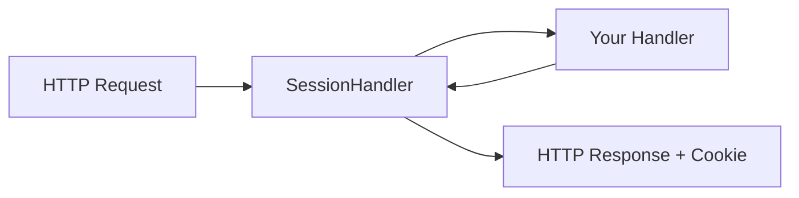

# Crystal HTTP::Server Integration

Integrate Session with Crystal's built-in HTTP::Server for lightweight applications.

## Overview



## Basic Setup

### 1. Define Session Data

```crystal
require "session"

class UserSession < Session::Base
  property user_id : Int64?
  property username : String?
  property role : String = "guest"
end
```

### 2. Configure Session

```crystal
Session.configure do |config|
  config.secret = ENV["SESSION_SECRET"]
  config.timeout = 24.hours
  config.session_key = "_myapp_session"
  config.store = Session::MemoryStore(UserSession).new
end
```

### 3. Use the Built-in Handler

Session provides a ready-to-use `SessionHandler`:

```crystal
require "http/server"

store = Session.config.store.not_nil!

server = HTTP::Server.new([
  Session::SessionHandler.new(store),
  MyAppHandler.new,
])

server.listen(8080)
puts "Server listening on http://localhost:8080"
```

### 4. Access Sessions in Your Handler

```crystal
class MyAppHandler
  include HTTP::Handler

  def call(context : HTTP::Server::Context)
    store = Session.config.store.not_nil!

    case context.request.path
    when "/login"
      handle_login(context, store)
    when "/profile"
      handle_profile(context, store)
    when "/logout"
      handle_logout(context, store)
    else
      context.response.print "Hello! <a href='/login'>Login</a>"
    end
  end

  private def handle_login(context, store)
    # Create or regenerate session
    store.regenerate_id
    store.current_session.user_id = 1
    store.current_session.username = "alice"
    store.current_session.role = "admin"

    store.flash["notice"] = "Welcome back!"

    context.response.status = HTTP::Status::FOUND
    context.response.headers["Location"] = "/profile"
  end

  private def handle_profile(context, store)
    if store.current_session.user_id
      notice = store.flash.now["notice"]?
      html = <<-HTML
        #{notice ? "<p style='color:green'>#{notice}</p>" : ""}
        <h1>Profile</h1>
        <p>User: #{store.current_session.username}</p>
        <p>Role: #{store.current_session.role}</p>
        <a href="/logout">Logout</a>
      HTML
      context.response.print html
    else
      context.response.status = HTTP::Status::FOUND
      context.response.headers["Location"] = "/login"
    end
  end

  private def handle_logout(context, store)
    store.delete
    store.flash["notice"] = "You have been logged out"

    context.response.status = HTTP::Status::FOUND
    context.response.headers["Location"] = "/"
  end
end
```

## Custom Session Handler

If you need custom behavior, implement your own handler:

```crystal
class CustomSessionHandler
  include HTTP::Handler

  def initialize(@store : Session::MemoryStore(UserSession))
  end

  def call(context : HTTP::Server::Context)
    # Load session from request cookies
    @store.load_from(context.request.cookies)

    begin
      call_next(context)
    ensure
      # Always set session cookie in response
      @store.set_cookies(context.response.cookies)
    end
  rescue Session::SessionExpiredException
    handle_expired_session(context)
  rescue Session::SessionCorruptionException
    handle_corrupted_session(context)
  end

  private def handle_expired_session(context)
    @store.create
    call_next(context)
    @store.set_cookies(context.response.cookies)
  end

  private def handle_corrupted_session(context)
    @store.create
    @store.flash["error"] = "Your session was invalid. Please log in again."
    call_next(context)
    @store.set_cookies(context.response.cookies)
  end
end
```

## Complete Example

```crystal
require "http/server"
require "session"

# Define session structure
class UserSession < Session::Base
  property user_id : Int64?
  property username : String?
  property cart_items : Array(Int64) = [] of Int64
end

# Configure
Session.configure do |config|
  config.secret = ENV.fetch("SESSION_SECRET", "dev-secret-change-in-production!")
  config.timeout = 1.hour
  config.sliding_expiration = true
  config.store = Session::MemoryStore(UserSession).new
end

store = Session.config.store.not_nil!

# Application handler
class AppHandler
  include HTTP::Handler

  def call(context : HTTP::Server::Context)
    store = Session.config.store.not_nil!

    case {context.request.method, context.request.path}
    when {"GET", "/"}
      render_home(context, store)
    when {"POST", "/cart/add"}
      add_to_cart(context, store)
    when {"GET", "/cart"}
      show_cart(context, store)
    else
      context.response.status = HTTP::Status::NOT_FOUND
      context.response.print "Not Found"
    end
  end

  private def render_home(context, store)
    cart_count = store.current_session.cart_items.size
    context.response.content_type = "text/html"
    context.response.print <<-HTML
      <h1>Shop</h1>
      <p>Cart: #{cart_count} items</p>
      <form method="POST" action="/cart/add">
        <input type="hidden" name="item_id" value="#{rand(1000)}">
        <button>Add Random Item</button>
      </form>
      <a href="/cart">View Cart</a>
    HTML
  end

  private def add_to_cart(context, store)
    if item_id = context.request.form_params["item_id"]?
      store.current_session.cart_items << item_id.to_i64
      store.flash["notice"] = "Item added to cart!"
    end
    context.response.status = HTTP::Status::FOUND
    context.response.headers["Location"] = "/"
  end

  private def show_cart(context, store)
    items = store.current_session.cart_items
    context.response.content_type = "text/html"
    context.response.print <<-HTML
      <h1>Your Cart</h1>
      <ul>
        #{items.map { |id| "<li>Item ##{id}</li>" }.join}
      </ul>
      <a href="/">Continue Shopping</a>
    HTML
  end
end

# Start server
server = HTTP::Server.new([
  Session::SessionHandler.new(store),
  AppHandler.new,
])

address = server.bind_tcp(8080)
puts "Listening on http://#{address}"
server.listen
```

## Production Configuration

```crystal
Session.configure do |config|
  config.secret = ENV["SESSION_SECRET"]
  config.timeout = 24.hours
  config.session_key = "_app_session"

  # Security
  config.use_kdf = true
  config.bind_to_ip = true
  config.bind_to_user_agent = true

  # Performance
  config.sliding_expiration = true
  config.compress_data = true

  # Use Redis for production
  config.store = Session::RedisStore(UserSession).new(
    client: Redis.new(url: ENV["REDIS_URL"])
  )

  # Enable resilience
  config.enable_retry = true
  config.circuit_breaker_enabled = true
end
```

## Handler Order

Place the session handler early in the chain, after request tracking but before your application logic:

```crystal
store = Session.config.store.not_nil!

server = HTTP::Server.new([
  HTTP::LogHandler.new,                       # 1. Logging
  HTTP::ErrorHandler.new,                     # 2. Error handling
  Session::SessionHandler.new(store),         # 3. Session management
  AuthHandler.new,                            # 4. Authentication
  AppHandler.new,                             # 5. Application
])
```
