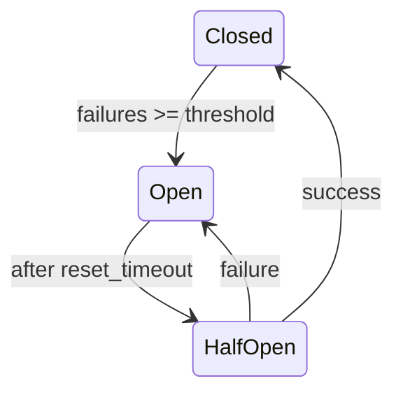

# Circuit Breaker

The circuit breaker prevents cascading failures by detecting backend outages and failing fast instead of waiting for timeouts.

## States



| State | Behavior |
|-------|----------|
| **Closed** | Normal operation. Requests pass through. Failures are counted. |
| **Open** | Fail fast. Raises `CircuitOpenException` immediately. |
| **HalfOpen** | Probe. Allows `half_open_max_calls` requests through to test recovery. |

## Configuration

```crystal
Session.configure do |config|
  config.circuit_breaker_enabled = true
  config.circuit_breaker_config = Session::CircuitBreakerConfig.new(
    failure_threshold: 5,           # Failures before opening
    reset_timeout: 30.seconds,      # Time before probing recovery
    half_open_max_calls: 1          # Probe requests in half-open state
  )
end
```

## Properties

| Property | Type | Default | Description |
|----------|------|---------|-------------|
| `circuit_breaker_enabled` | `Bool` | `false` | Enable circuit breaker |
| `failure_threshold` | `Int32` | `5` | Consecutive failures before opening |
| `reset_timeout` | `Time::Span` | `30.seconds` | Wait time before half-open probe |
| `half_open_max_calls` | `Int32` | `1` | Max probe requests in half-open |

## How It Works

When enabled, the `RedisStore` wraps operations with the circuit breaker. On failure:

1. Failure count increments
2. When `failure_count >= failure_threshold`, circuit opens
3. In open state, all requests immediately raise `CircuitOpenException` (caught as `StorageConnectionException`)
4. After `reset_timeout`, circuit transitions to half-open and allows a probe request
5. If the probe succeeds, circuit closes. If it fails, circuit reopens.

## Monitoring

```crystal
breaker = store.circuit_breaker

breaker.state              # => CircuitState::Closed
breaker.failure_count      # => 0
breaker.allow_request?     # => true
breaker.time_until_retry   # => nil (or Time::Span when open)
```

## Manual Reset

```crystal
store.circuit_breaker.try(&.reset!)
```

## See Also

- [Retry Logic](retry-logic.md)
- [Error Handling](error-handling.md)
