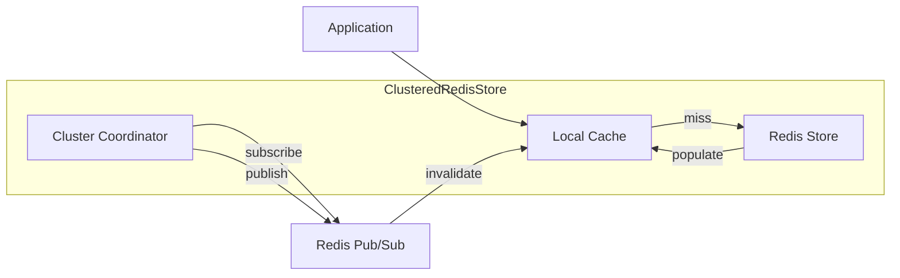
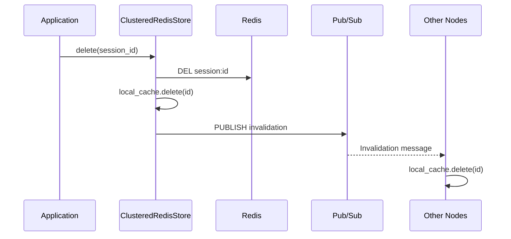

# Clustered Redis Store

The Clustered Redis Store extends the standard Redis Store with local caching and cluster-wide session invalidation via Redis Pub/Sub.

## Overview



## Basic Usage

```crystal
require "session"

# Define session data
struct UserSession
  include Session::SessionData
  property user_id : Int64?
  property username : String?
end

# Configure with clustering
Session.configure do |config|
  config.secret = ENV["SESSION_SECRET"]
  config.timeout = 1.hour

  # Enable clustering
  config.cluster.enabled = true
  config.cluster.node_id = ENV["NODE_ID"]? || UUID.random.to_s

  # Use clustered store
  config.provider = Session::ClusteredRedisStore(UserSession).new(
    client: Redis.new(host: "redis.example.com")
  )
end
```

## Features

### Local Caching

Sessions are cached locally to reduce Redis roundtrips:

```crystal
store = Session::ClusteredRedisStore(UserSession).new(client: Redis.new)

# First access - fetches from Redis, caches locally
session = store[session_id]

# Second access - returns from local cache (no Redis call)
session = store[session_id]

# Check cache statistics
stats = store.cache_stats
puts "Hit rate: #{(stats.hit_rate * 100).round(1)}%"
```

### Cluster Invalidation

When a session is deleted, all cluster nodes are notified:



### Message Types

| Message Type | Trigger | Action on Other Nodes |
|--------------|---------|----------------------|
| `SessionDeleted` | `store.delete(id)` | Evict from local cache |
| `SessionInvalidated` | `store[id] = session` | Evict from local cache |
| `CacheClear` | `store.clear` | Clear entire local cache |

## API Reference

### Constructor

```crystal
def initialize(
  client : Redis = Redis.new,
  config : ClusterConfig = ClusterConfig.new
)
```

### Store Operations

```crystal
store = Session::ClusteredRedisStore(UserSession).new(client: redis)

# Get session (checks cache first)
session = store[session_id]      # Raises if not found
session = store[session_id]?     # Returns nil if not found

# Set session (updates cache, broadcasts if configured)
store[session_id] = session

# Delete session (removes from Redis, cache, broadcasts)
store.delete(session_id)

# Clear all sessions (clears Redis, cache, broadcasts)
store.clear

# Get session count (from Redis)
count = store.size
```

### Cache Operations

```crystal
# Get cache statistics
stats = store.cache_stats
puts "Hits: #{stats.hits}"
puts "Misses: #{stats.misses}"
puts "Evictions: #{stats.evictions}"
puts "Size: #{stats.size}"
puts "Hit Rate: #{stats.hit_rate}"

# Manually evict from cache (doesn't delete from Redis)
store.evict_from_cache(session_id)

# Access coordinator and cache directly
store.coordinator.local_cache.clear
store.coordinator.local_cache.size
```

### Cluster Operations

```crystal
# Check if coordinator is running
store.coordinator.running?

# Get node ID
store.coordinator.node_id

# Manually publish invalidation
store.coordinator.publish_invalidation(session_id)
store.coordinator.publish_cache_clear
```

### Health & Lifecycle

```crystal
# Check Redis health
store.healthy?  # => true/false

# Graceful shutdown
store.shutdown  # Stops coordinator, closes Redis
```

### QueryableStore Methods

```crystal
# Iterate all sessions
store.each_session do |session|
  puts session.data.username
end

# Get all session IDs
ids = store.all_session_ids

# Bulk delete with predicate
deleted = store.bulk_delete { |s| s.data.user_id == compromised_id }
```

## Configuration Examples

### Production Setup

```crystal
Session.configure do |config|
  config.secret = ENV["SESSION_SECRET"]
  config.timeout = 24.hours

  # Cluster settings
  config.cluster.enabled = true
  config.cluster.node_id = ENV["NODE_ID"]
  config.cluster.channel = "prod:session:invalidate"
  config.cluster.local_cache_ttl = 1.minute
  config.cluster.local_cache_max_size = 100_000

  # Additional resilience
  config.circuit_breaker_enabled = true
  config.enable_retry = true
  config.encrypt_redis_data = true

  config.provider = Session::ClusteredRedisStore(UserSession).new(
    client: Redis.new(
      host: ENV["REDIS_HOST"],
      port: ENV["REDIS_PORT"].to_i,
      password: ENV["REDIS_PASSWORD"]?
    )
  )
end
```

### Development Setup

```crystal
Session.configure do |config|
  config.secret = "dev-secret-not-for-production"
  config.timeout = 1.hour

  # Disable clustering in development
  config.cluster.enabled = false
  config.cluster.local_cache_enabled = true
  config.cluster.local_cache_ttl = 10.seconds

  config.provider = Session::ClusteredRedisStore(UserSession).new(
    client: Redis.new
  )
end
```

### High-Traffic Setup

```crystal
Session.configure do |config|
  config.secret = ENV["SESSION_SECRET"]

  # Aggressive caching for high traffic
  config.cluster.enabled = true
  config.cluster.local_cache_ttl = 2.minutes
  config.cluster.local_cache_max_size = 500_000

  # Compression for large sessions
  config.compress_data = true
  config.compression_threshold = 256

  config.provider = Session::ClusteredRedisStore(UserSession).new(
    client: Redis.new(host: "redis-cluster.internal")
  )
end
```

## Comparison with Redis Store

| Aspect | RedisStore | ClusteredRedisStore |
|--------|------------|---------------------|
| Local caching | No | Yes |
| Pub/Sub sync | No | Yes |
| Read latency (cached) | Redis RTT | ~0 (memory) |
| Read latency (miss) | Redis RTT | Redis RTT |
| Write latency | Redis RTT | Redis RTT + cache |
| Delete latency | Redis RTT | Redis RTT + broadcast |
| Memory usage | Low | Higher (cache) |
| Consistency | Strong | Eventual |

## Best Practices

### 1. Use Unique Node IDs

```crystal
# Good: Consistent across restarts
config.cluster.node_id = ENV["NODE_ID"]

# Bad: Changes on each restart
config.cluster.node_id = UUID.random.to_s
```

### 2. Size Cache Appropriately

```crystal
# Estimate: 2-3x peak concurrent users
peak_users = 10_000
config.cluster.local_cache_max_size = peak_users * 2
```

### 3. Set TTL Based on Access Patterns

```crystal
# Frequently updated sessions: shorter TTL
config.cluster.local_cache_ttl = 15.seconds

# Stable sessions: longer TTL
config.cluster.local_cache_ttl = 2.minutes
```

### 4. Monitor Cache Performance

```crystal
# Log stats periodically
spawn do
  loop do
    stats = store.cache_stats
    Log.info { "Session cache: #{stats.size} entries, #{(stats.hit_rate * 100).round(1)}% hit rate" }
    sleep 1.minute
  end
end
```

### 5. Handle Graceful Shutdown

```crystal
at_exit do
  store.shutdown
end
```
