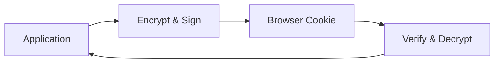

# Cookie Store

The Cookie Store encrypts and signs session data, storing it entirely in the client's browser.

## Overview



## Usage

```crystal
Session.configure do |config|
  config.secret = ENV["SESSION_SECRET"]
  config.store = Session::CookieStore(UserSession).new
end
```

## Characteristics

| Feature | Value |
|---------|-------|
| Storage | Client-side (browser) |
| Max Size | 4KB |
| Persistence | Cookie lifetime |
| Multi-node | Yes (stateless) |
| Encryption | AES-256-CBC |
| Signing | HMAC-SHA256 |

## Best For

- Serverless/edge deployments
- Simple applications
- Small session data (< 4KB)
- Stateless architectures

## Limitations

- 4KB size limit
- Data sent with every request
- Cannot revoke sessions server-side
