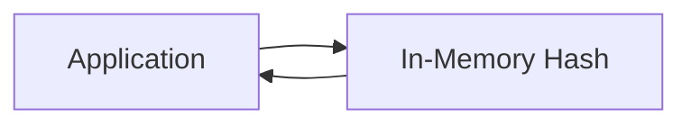

# Memory Store

The Memory Store keeps sessions in server memory for fast access.

## Overview



## Usage

```crystal
Session.configure do |config|
  config.store = Session::MemoryStore(UserSession).new
end
```

## Characteristics

| Feature | Value |
|---------|-------|
| Storage | Server memory |
| Max Size | Available RAM |
| Persistence | None (lost on restart) |
| Multi-node | No |
| Speed | Fastest |

## Best For

- Development and testing
- Single-server deployments
- Prototype applications

## Memory Management

```crystal
store = Session::MemoryStore(UserSession).new

# Cleanup expired sessions
expired = store.cleanup_expired
puts "Cleaned up #{expired} expired sessions"

# Get memory statistics
stats = store.memory_stats
puts "Total: #{stats[:total_sessions]}"
puts "Valid: #{stats[:valid_sessions]}"
puts "Expired: #{stats[:expired_sessions]}"
```

## Limitations

- Sessions lost on restart
- Not shared across servers
- Memory grows with sessions
