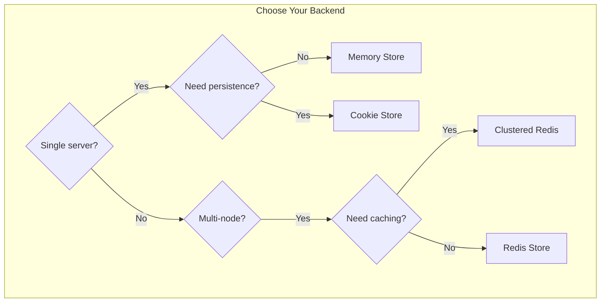
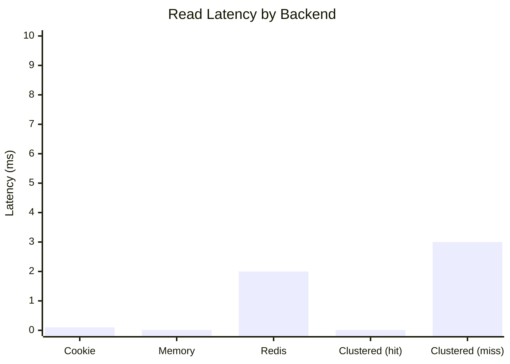

# Storage Backends Overview

Session supports multiple storage backends, each optimized for different use cases.

## Comparison



## Backend Comparison Table

| Feature | Cookie | Memory | Redis | Clustered Redis |
|---------|--------|--------|-------|-----------------|
| **Persistence** | Client-side | None | Redis | Redis |
| **Multi-node** | Yes | No | Yes | Yes |
| **Local Cache** | N/A | N/A | No | Yes |
| **Pub/Sub Sync** | N/A | N/A | No | Yes |
| **Max Size** | 4KB | Memory | Unlimited | Unlimited |
| **Best For** | Simple apps | Development | Production | High-scale |

## Quick Selection Guide

### Cookie Store

```crystal
config.store = Session::CookieStore(UserSession).new
```

**Use when:**
- Stateless deployment (serverless, edge)
- Session data is small (< 4KB)
- No server-side storage needed

### Memory Store

```crystal
config.store = Session::MemoryStore(UserSession).new
```

**Use when:**
- Development and testing
- Single-server deployment
- Sessions can be lost on restart

### Redis Store

```crystal
config.store = Session::RedisStore(UserSession).new(
  client: Redis.new
)
```

**Use when:**
- Production deployment
- Multiple servers sharing sessions
- Session persistence required

### Clustered Redis Store

```crystal
config.cluster.enabled = true
config.store = Session::ClusteredRedisStore(UserSession).new(
  client: Redis.new
)
```

**Use when:**
- High-traffic production deployment
- Multiple servers with local caching
- Reduced Redis load important
- Real-time session invalidation needed

## Performance Characteristics



| Operation | Cookie | Memory | Redis | Clustered (hit) | Clustered (miss) |
|-----------|--------|--------|-------|-----------------|------------------|
| Read | ~0.1ms | ~0.01ms | ~1-5ms | ~0.01ms | ~1-5ms |
| Write | ~0.1ms | ~0.01ms | ~1-5ms | ~1-5ms | ~1-5ms |
| Delete | N/A | ~0.01ms | ~1-5ms | ~1-5ms + pub | ~1-5ms + pub |
