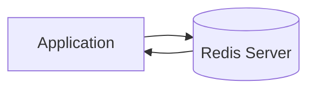

# Redis Store

The Redis Store provides persistent, distributed session storage.

## Overview



## Usage

```crystal
Session.configure do |config|
  config.provider = Session::RedisStore(UserSession).provider(
    client: Redis.new(host: "localhost", port: 6379)
  )
end
```

## Characteristics

| Feature | Value |
|---------|-------|
| Storage | Redis server |
| Max Size | Redis memory |
| Persistence | Redis persistence |
| Multi-node | Yes |
| TTL | Automatic |

## Best For

- Production deployments
- Multi-server architectures
- Session persistence required

## With Encryption

```crystal
Session.configure do |config|
  config.encrypt_redis_data = true
  config.provider = Session::RedisStore(UserSession).provider(
    client: Redis.new
  )
end
```

## With Circuit Breaker

```crystal
Session.configure do |config|
  config.circuit_breaker_enabled = true
  config.provider = Session::RedisStore(UserSession).provider(
    client: Redis.new
  )
end
```

## Health Check

```crystal
store = Session::RedisStore(UserSession).new(client: Redis.new)
puts store.healthy?  # => true/false
```

## For High Traffic

Consider the [Clustered Redis Store](clustered-redis-store.md) for local caching and reduced Redis load.
